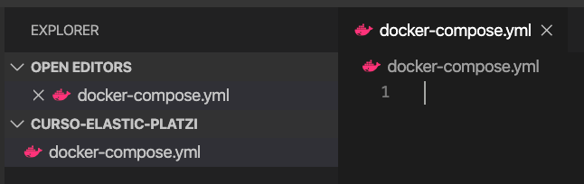
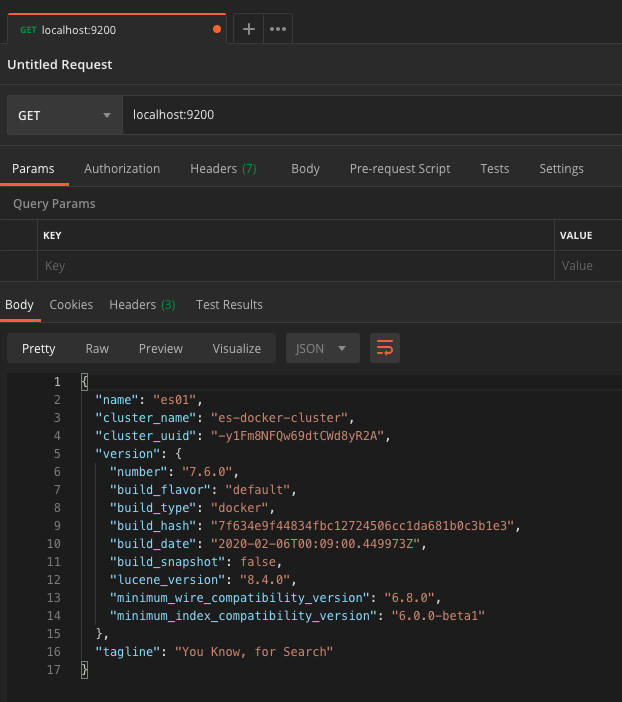

# Clase 03 - Poner a Correr ElasticSearch

## Paso 1 - Instalar Postman

Para instalar postman accedes a la URL https://www.postman.com/downloads/ la cual te provee con el instalador de tu sistema operativo.

### Mac


Para la instalación en Mac bajamos el archivo .zip que contiene el instalador. Luego descomprimes este archivo y te queda un instalador llamado **Postman 2**. 


Haces doble clic sobre instalador y aparece una ventana recordando que es un ejecutable bajado de internet, le das clic en abrir.


Luego el instalador te pregunta si quieres mover la aplicación al folder de Applications, le das que si quiere moverla y enseguida tendrás la aplicación abierto y lista para usar.


## Paso 2 - Crear archivo de configuración
Para crear el archivo de configuración te recomiendo utilices un directorio personalizado para este curso, en el cual puedas guardar todos los archivos que usarás. Entonces lo primero será crear este directorio y entrar en él.

```python
$ mkdir curso-elastic-platzi
$ cd curso-elastic-platzi
```

Luego abres un editor de texto (te recomendamos **Visual Studio Code**) y creas un archivo dentro de este directorio. El nombre del archivo es **`docker-compose.yml`**



Una vez creado el archivo, le vas a agregar la siguiente configuración

```python
version: '2.2'
services:
  es01:
    image: docker.elastic.co/elasticsearch/elasticsearch:7.6.0
    container_name: es01
    environment:
      - node.name=es01
      - cluster.name=es-docker-cluster
      - cluster.initial_master_nodes=es01
      - bootstrap.memory_lock=true
      - "ES_JAVA_OPTS=-Xms512m -Xmx512m"
    ulimits:
      memlock:
        soft: -1
        hard: -1
    volumes:
      - data01:/usr/share/elasticsearch/data
    ports:
      - 9200:9200
    networks:
      - elastic

volumes:
  data01:
    driver: local

networks:
  elastic:
    driver: bridge
```

Este archivo es basado en las configuraciones recomendadas para correr ElasticSearch con Docker. Esta guía se puede consultar en https://www.elastic.co/guide/en/elasticsearch/reference/7.6/docker.html.

Acá un breve repaso de lo que hace este archivo:

1. Le dice a docker que use la imagen de ElasticSearch con versión **7.6.0**. Esta es la versión que vas a usar durante el curso.
2. Le dice que el nombre del contenedor será **es01**
3. Le indica unas configuraciones para crear el cluster y el nodo por defecto
4. Le indica que el puerto sobre el que corre ElasticSearch es el **9200**. A su vez le dice que exponga ese mismo puerto a tu máquina para que puedas usar el servicio bajo el puerto estándar.

Por ultimo guardamos el archivo

## Paso 3 - Levantar el servicio
Luego de tener el archivo listo, le dice a docker que levante el servicio ejecutando el siguiente comando

```python
$ docker-compose up
```

Este comando se encarga de ejecutar las directivas que especificamos en el archivo y esto resultará en el servicio de ElasticSearch funcionando correctamente en el puerto **9200**. Esto puede tomar unos segundos mientras se configura el contenedor y se levanta el servicio.

Para comprobar que ElasticSearch ya está corriendo sobre tu máquina, entonces abres Postman y ejecutas un GET sobre la url http://localhost:9200. Si todo salió correctamente verás un resultado similar a este


