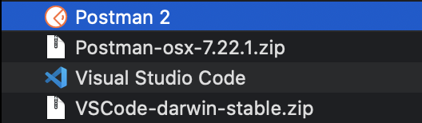
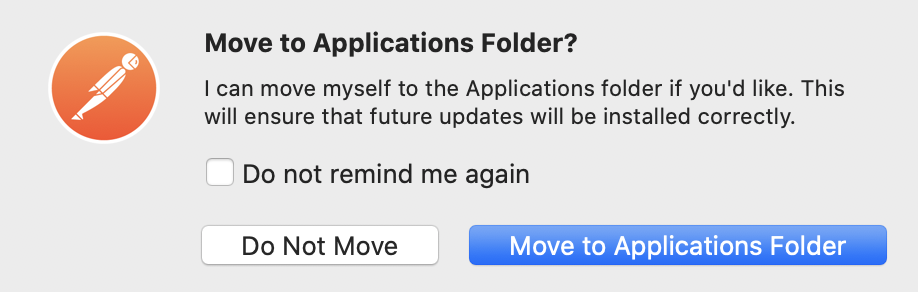
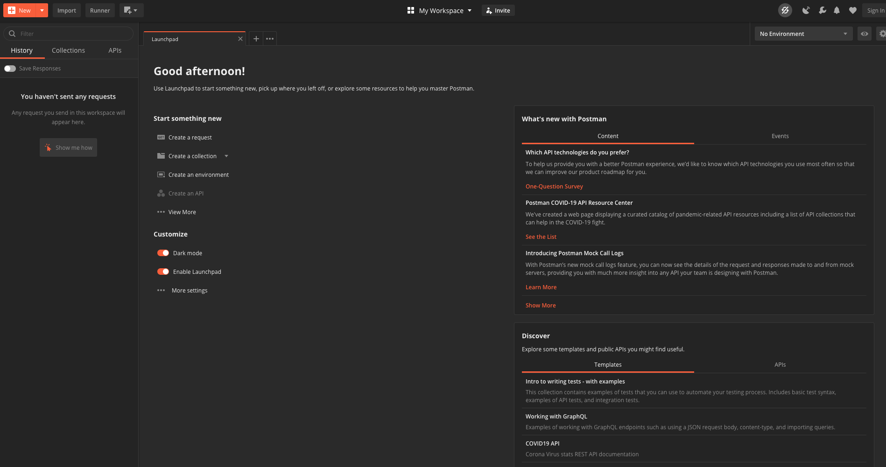

# Clase 03 - Poner a Correr ElasticSearch

## Paso 1 - Instalar Postman

Para instalar postman accedes a la URL https://www.postman.com/downloads/ la cual te provee con el instalador de tu sistema operativo.

### Mac


Para la instalación en Mac bajamos el archivo .zip que contiene el instalador. Luego descomprimes este archivo y te queda un instalador llamado **Postman 2**. 



Haces doble clic sobre instalador y aparece una ventana recordando que es un ejecutable bajado de internet, le das clic en abrir.



Luego el instalador te pregunta si quieres mover la aplicación al folder de Applications, le das que si quiere moverla y enseguida tendrás la aplicación abierto y lista para usar.




## Paso 1 - Crear archivo de configuración
- **`mkdir curso-elastic-platzi`**
- **`cd curso-elastic-platzi`**
- Abrimos directorio con Sublime (u otro editor de texto)
- Creamos **`docker-compose.yml`**

```python
version: '2.2'
services:
  es01:
    image: docker.elastic.co/elasticsearch/elasticsearch:7.6.0
    container_name: es01
    environment:
      - node.name=es01
      - cluster.name=es-docker-cluster
      - cluster.initial_master_nodes=es01
      - bootstrap.memory_lock=true
      - "ES_JAVA_OPTS=-Xms512m -Xmx512m"
    ulimits:
      memlock:
        soft: -1
        hard: -1
    volumes:
      - data01:/usr/share/elasticsearch/data
    ports:
      - 9200:9200
    networks:
      - elastic

volumes:
  data01:
    driver: local

networks:
  elastic:
    driver: bridge
```

## Paso 2 - Levantar el servicio
- **`docker-compose up`**
- Esperamos a que levante, mientras tanto abrimos **Postman**

```java
GET http://localhost:9200
```
